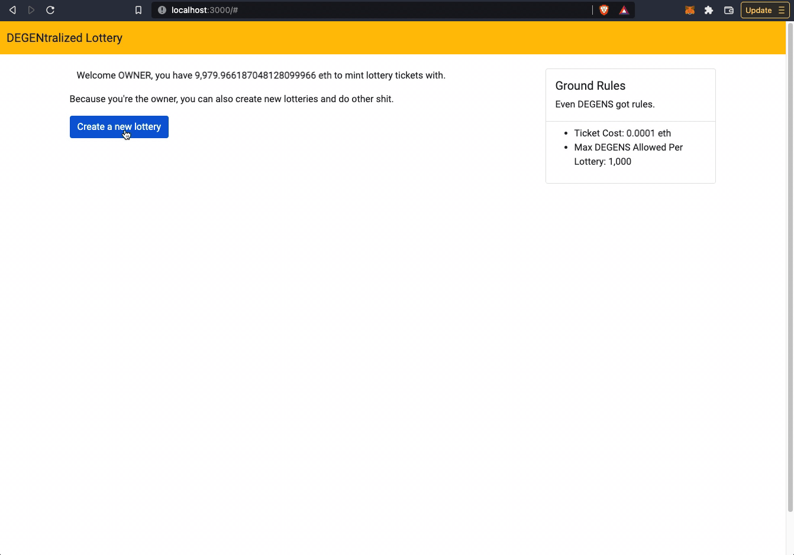

# DEGENtralized Lottery v0.1

A decentralized lottery Dapp. For degenerates.

This project is a demo front end implementation with a decentralized lottery smart contract built on ethereum. It allows:

- the ability to create lotteries with customizable parameters like maximum number of participants, variable minting time periods, or ticket price floor
- players to mint lottery tickets by depositing eth - where their odds of winning correspond to the proportion of tickets they mint relative to the total pot
- lottery drawings to be triggered (by the contract owner) which selects a random winner
- winnings to be withdrawn by the winner

Built with Solidity and React using [Hardhat](https://hardhat.org/) and [Hardhat hackathon boilerplate](https://github.com/NomicFoundation/hardhat-hackathon-boilerplate).

## Quick Start

Clone this repository and install its dependencies:

```sh
$ git clone https://github.com/yan-man/lottery-smart-contract.git
$ cd lottery-smart-contract
$ npm install
```

Then run Hardhat's testing network:

```sh
$ npx hardhat node
```

Then, on a new terminal, go to the repository's root folder and run this to
deploy your contract:

```sh
$ npx hardhat run scripts/deploy.js --network localhost
```

You should see contract address details in response:


Finally, we can run the frontend with:

```sh
$ cd frontend
$ npm install
$ npm start
```

Open [http://localhost:3000/](http://localhost:3000/) to see your Dapp. You will
need to have [Metamask](https://metamask.io) installed and listening to
`localhost 8545`.

## User Guide

First, connect your wallet. You should be redirected to the Dapp.


### Initializing Lottery

The first address provided by Hardhat's local network is the contract `Owner`. Connect to Metamask using that account. `Owner` has special privileges.

[`Owner`] Create a new lottery instance by clicking the button. Accept the Metamask prompt.



Lottery details should populate. `Players` can use eth to mint lottery tickets. Each ticket costs `0.0001 eth` to mint. The countdown shows you how long is remaining until the minting period ends, at which point no more tickets can be created for the current lottery.

### Minting Tickets

You can switch accounts to any `Player` (including `Owner`) via Metamask to mint lottery tickets. More participants will make the demo more interesting and actually give you a non-guaranteed chance of winning!


Enter some amount of eth and it should calculate how many tickets you are able to mint, as well as your odds of winning the lottery, which is based on the proportion of tickets you have minted relative to the total. For example, if there are 3,000 total tickets and you mint 1,000 more, you would have a 25% chance of winning.


The same `Player` can mint tickets multiple times, manipulating their ticket position.

### Minting Period

At the end of the minting period, ticket sales are closed and ticket minting is suspended. This can also be done manually by `Owner`. The minting period must be ended before a lottery drawing can be triggered.

For the demo, close the minting period by pressing the button `[Emergency] End Minting Period`.


### Lottery Drawing

`Owner` can start the lottery drawing after the minting period has ended. In this `v0.1.0` demo, the winner is not randomly selected. **Rather, the winner is the participant with the ticket position at the 75th percentile of total ticket purchases.** See mechanics section for details.

There are 2 transactions required to approve to complete the lottery drawing - (1) to find the winner, and (2) to deposit the prize amount to the winner's Pending Withdrawal. Winner info should be populated after successful transaction.


### Withdraw Winnings

The winner can withdraw their winnings. You must be signed into the winner's account on Metamask to have the `withdraw` option available.


### Notes

Demo is only supported for the first lottery run. After lottery drawing has occurred and winner has withdrawn funds, re-deploy the contract and restart the front end to try again.

## Mechanics

### Rules

By default, the lottery minting period will be open for 1 hour. Lottery drawings can only occur after lottery minting period has ended, or lottery has been rendered inactive.

### How is the Winner Determined?

In `v0.1.0`, the winner is not randomly selected (future implementations will be - randomness requires integration of off-chain oracles). It is the participant with the ticket position at the 75th percentile of total ticket purchases. Ticket distributions are determined after minting period has closed, and are in ascending order of initial purchase.

For example, if `Player1` buys 20 tickets (1) and `Player2` buys 70 tickets (2), then `Player1` buys another 10 tickets (3), there would be a total of 100 tickets. `Player1`'s ticket positions would be from 1-30, and `Player2`'s from 31-100.

Because the winner is determined at the 75th percentile, that would mean the player with the ticket position at 75 would win, ie `Player2`.

## Smart Contract Testing

See [Hardhat](https://hardhat.org/tutorial/testing-contracts.html) for more details on testing.

Navigate to root directory, then start tests. There should be 17 passing tests. In `v0.1.0` these are mostly just tests on the happy path.

```sh
$ npx hardhat test
```


## Further

### `Lottery.sol`

- add transaction fees for contract owner
- implementation of cryptographic random number generator (https://docs.chain.link/docs/get-a-random-number/)
- allow for multiple concurrent lotteries
- prevent owner from participating in lottery for conflict of interest sake
- deploy on test net: maybe rinkeby to handle chain link
- currently the process of performing a lottery drawing was split into 2 functions - `triggerLotteryDrawing` and `triggerDepositWinnings` just in case the binary search took too much gas. Maybe these functions can be combined together.

### Front End

- refactor components, create utility modules, etc.
- improve CSS, UI/UX, etc

## What’s Included?

Your environment will have everything you need to build a Dapp powered by Hardhat and React.

- [Frontend/Dapp](./frontend): A [Create React App](https://github.com/facebook/create-react-app) Dapp which interacts with the `Lottery.sol` smart contract.
- [Hardhat](https://hardhat.org/): An Ethereum development task runner and testing network.
- [Mocha](https://mochajs.org/): A JavaScript test runner.
- [Chai](https://www.chaijs.com/): A JavaScript assertion library.
- [ethers.js](https://docs.ethers.io/v5/): A JavaScript library for interacting with Ethereum.
- [Waffle](https://github.com/EthWorks/Waffle/): To have Ethereum-specific Chai assertions/mathers.
