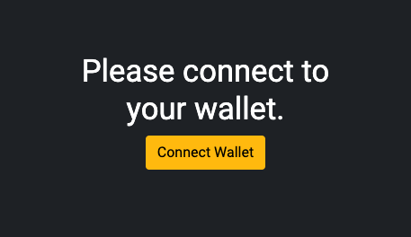
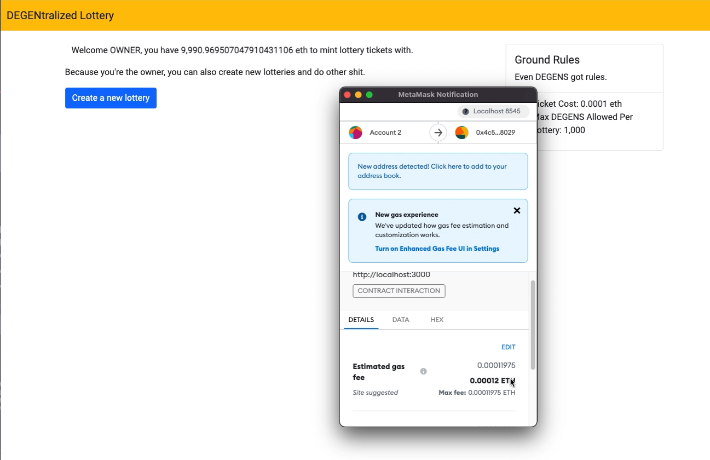
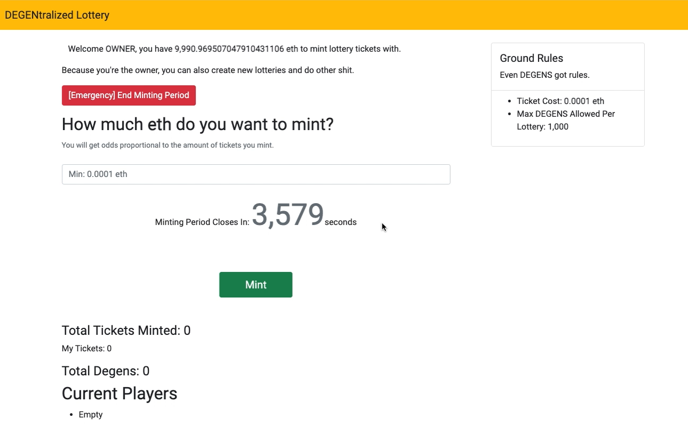
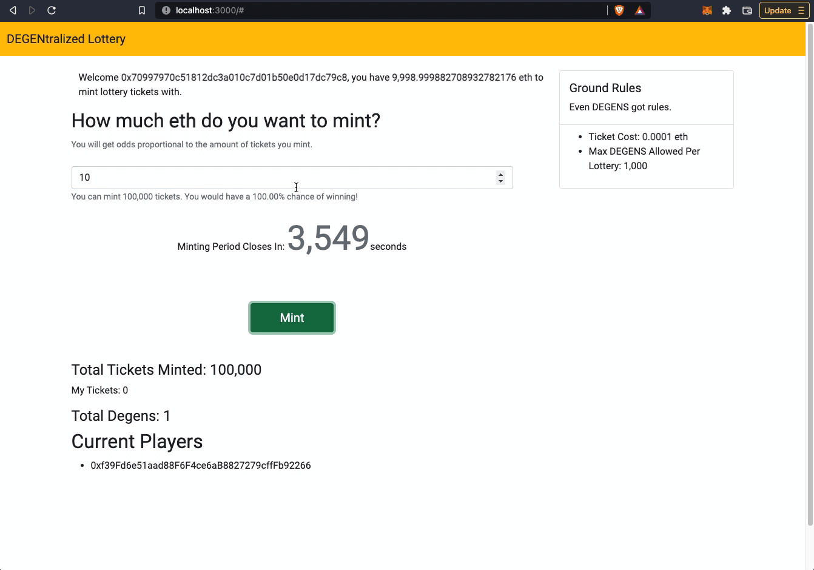
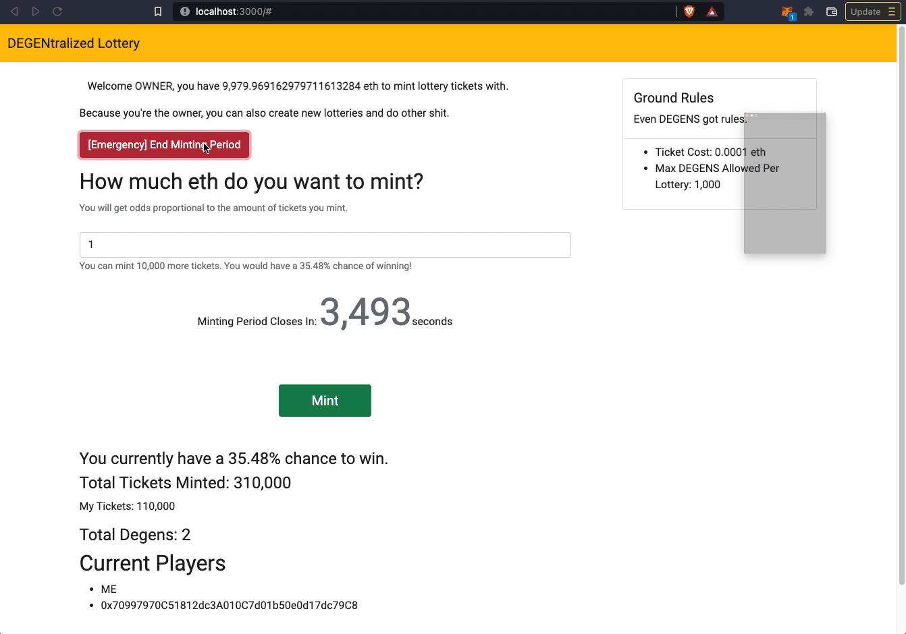
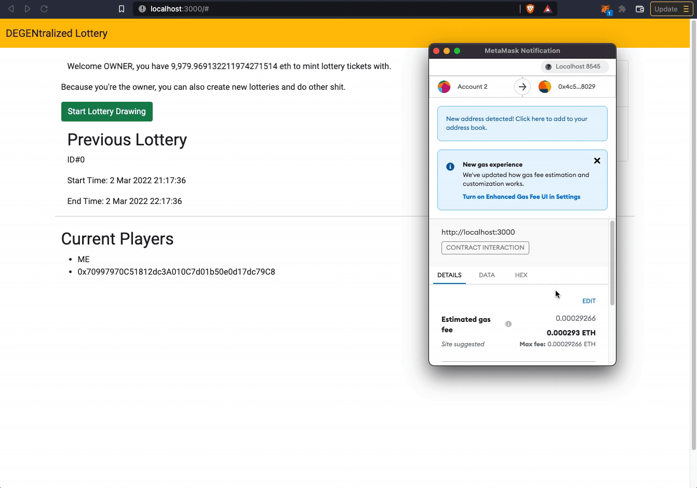
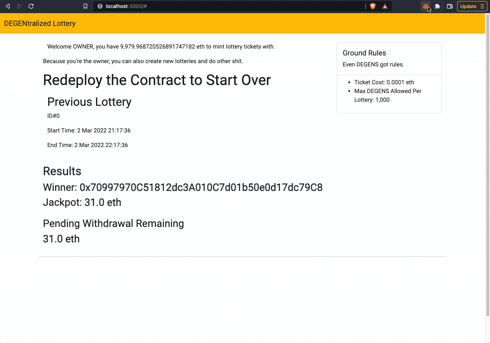
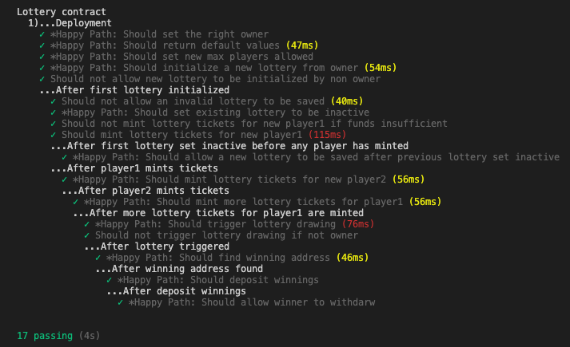
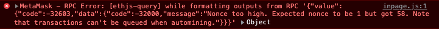
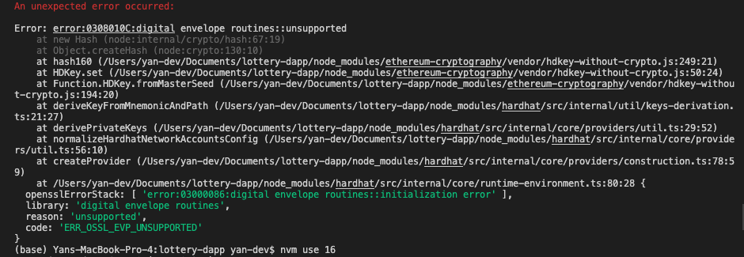

[](https://codecov.io/gh/yan-man/lottery-dapp) [](https://circleci.com/gh/yan-man/lottery-dapp/tree/master)

# DEGENtralized Lottery v0.1

A decentralized lottery Dapp. For degenerates.

This project is a front end demo of a decentralized lottery smart contract built on ethereum. It allows:

- the ability to create lotteries with customizable parameters like maximum number of participants, variable minting time periods, or ticket price floor
- players to mint lottery tickets by depositing eth - where their odds of winning correspond to the proportion of tickets they mint relative to the total pot
- lottery drawings to be triggered (by the contract owner) which selects a random winner
- winnings to be withdrawn by the winner

Built with Solidity and React using [Hardhat](https://hardhat.org/) and [Hardhat hackathon boilerplate](https://github.com/NomicFoundation/hardhat-hackathon-boilerplate).

## Testnet

Contracts are deployed onto Goerli testnet: [0x62cD86Aa0354F8048C883B808d58b1188f4650c4](https://goerli.etherscan.io/address/0x62cD86Aa0354F8048C883B808d58b1188f4650c4#code)

## Quick Start

Clone this repository and install its dependencies:

```sh
$ git clone https://github.com/yan-man/lottery-smart-contract.git
$ cd lottery-smart-contract
$ npm install
```

Then run Hardhat's testing network:

```sh
$ npx hardhat node
```

Then on a new terminal, go to the repository's root folder and run this to
deploy your contract:

```sh
$ npx hardhat run scripts/deploy.ts --network localhost
```

You should see contract deployment status displayed on the terminal.


Run the frontend with:

```sh
$ cd frontend
$ npm install
$ npm start
```

Open [http://localhost:3000/](http://localhost:3000/) to interact with the Dapp. You will
need to have [Metamask](https://metamask.io) installed and listening to
`localhost 8545`.

## User Guide

First, connect your wallet.



### Initializing Lottery

The first address provided by Hardhat's local network is the contract `Owner`. Connect to Metamask using that account. `Owner` has special privileges.

[`Owner`] Create a new lottery instance by clicking the `Create a new lottery` button. Accept the Metamask transaction.



Lottery details should populate. `Players` can use eth to mint lottery tickets - each one costs `0.0001 eth`. The countdown shows you how long is remaining until the minting period ends, at which point no more tickets can be minted for the current lottery.



### Minting Tickets

You can switch accounts to any `Player` (including `Owner`) via Metamask to mint lottery tickets. More participants will make the demo more interesting and actually give you a non-guaranteed chance of winning!


Enter some amount of eth and it should calculate how many tickets you are able to mint, as well as your odds of winning the lottery, which is based on the proportion of tickets you have minted relative to the total. For example, if there are 3,000 total tickets and you mint 1,000 more, you would have a 25% chance of winning (ie, you own 1,000 of a total of 4,000 outstanding tickets).



The same `Player` can mint tickets multiple times, manipulating their ticket position.

### Minting Period

At the end of the minting period, ticket sales are closed and ticket minting is suspended. This can also be done manually by `Owner`. The minting period must be ended before a lottery drawing can be triggered.

For the demo, close the minting period by pressing the button `[Emergency] End Minting Period`.



### Lottery Drawing

`Owner` can start the lottery drawing after the minting period has ended. In this `v0.1` demo, the winner is randomly selected via a naive random algorithm based on blocknumber. See mechanics section for details.

There are 2 transactions required to approve to complete the lottery drawing - (1) to find the winner, and (2) to deposit the prize amount to the winner's Pending Withdrawal. Winner info should be populated after successful transaction.



### Withdraw Winnings

The winner can withdraw their winnings. You must be signed into the winner's account on Metamask to have the `withdraw` option available.



## Smart Contract

**Note**: Demo is only supported for the first lottery run. After lottery drawing has occurred and winner has withdrawn funds, re-deploy the contract and restart the front end to try again.

## Mechanics

### Rules

By default, the lottery minting period will be open for 1 hour. Lottery drawings can only occur after lottery minting period has ended, or lottery has been rendered inactive.

### How is the Winner Determined?

In `v0.1.5` onwards, the winner is randomly selected utilizing a naive algorithm based on block number (future implementations from `v0.2` onwards will be cleaner - randomness will integrate off-chain oracles via [Chainlink VRF](https://docs.chain.link/docs/chainlink-vrf/)). See `Random.sol` custom library for more details. Ticket distributions are determined after minting period has closed, and are in ascending order of initial purchase.

Each player's odds of winning are determined by the percentage of outstanding tickets that they own.

For example, if `Player1` buys 20 tickets (1) and `Player2` buys 70 tickets (2), then `Player1` buys another 10 tickets (3), there would be a total of 100 tickets. `Player1`'s ticket positions would be from 1-30, and `Player2`'s from 31-100.

The winners' odds are directly correlated to the proportion of outstanding tickets they own for that lottery. `Player1` in the example above would have a 30% chance of winning (they hold 30 tickets out of the total of 100 tickets sold), and `Player2` would have a 70% chance of winning (they hold 70 tickets out of the total of 100).

## Smart Contract Testing

See [Hardhat](https://hardhat.org/tutorial/testing-contracts.html) for more details on testing.

Navigate to root directory, then start tests. There should be 17 passing tests. In `v0.1` these are mostly just tests on the happy path.

```sh
$ npx hardhat test
```



## Design Patterns

### Withdrawal Pattern

Allow users to withdraw winnings from pending withdrawals rather than pushing winnings to them.

### Gas Optimization

Rather than deleting variables, overwrite them (during lottery reset). This especially applies to `array` types - in successive lotteries, overwrite array keys if possible rather than appending. Because we'll be overwriting, cannot trust `listOfPlayers` array to store ground truth on participants (they could be vestiges from previous lotteries). Rather than having to loop over the full list to check they are active in the current lottery, store another variable mapping `players` to keep track of active participants in current lottery.

Manage ticket distributions by storing the starting/ending ticket index corresponding to each `player` rather than storing the , which would be dynamically sized and could grow large depending on the pot size. By limiting max number of participants, we can cap the `ticketDistribution` array to be of size `numActivePlayers` rather than `numTotalTickets`.

### Access Restriction

`Ownable` contract restricts some functions from non-Owner access.

## Troubleshooting

As described in the [Hardhat Github](https://github.com/NomicFoundation/hardhat-hackathon-boilerplate), you may see the following bug in your console. Simply reset your account and try again: Metamask -> Settings -> Advanced -> Reset Account.



If you encounter the following error make sure you're on npm v16: `nvm use 16`



## Further

### `Lottery.sol`

- add transaction fees for contract owner
- implementation of oracle as [random number generator](https://docs.chain.link/docs/get-a-random-number/)
- allow for multiple concurrent lotteries
- prevent owner from participating in lottery for conflict of interest's sake
- deploy on test net: maybe Rinkeby to handle the random number generator dev tool
- currently the process of performing a lottery drawing was split into 2 functions - `triggerLotteryDrawing` and `triggerDepositWinnings` just in case the binary search took too much gas, rendering the winnign funds un-deposited. Maybe these functions can be combined together with no loss in fidelity.
- create refund functionality for when previous lotteries are cancelled without determining a winner.

### `Random.sol`

- implement [Chainlink VRF](https://docs.chain.link/docs/chainlink-vrf/) for verifiable random number generation

### Front End

- refactor components, create utility modules, etc.
- improve CSS, UI/UX, etc.

### Testing

- more tests for failure paths; increase code coverage.

## What’s Included?

- [Frontend/Dapp](./frontend): A [Create React App](https://github.com/facebook/create-react-app) Dapp which interacts with the `Lottery.sol` smart contract.
- [Hardhat](https://hardhat.org/): Ethereum development task runner and testing network.
- [Mocha](https://mochajs.org/): JavaScript test runner.
- [Chai](https://www.chaijs.com/): JavaScript assertion library.
- [ethers.js](https://docs.ethers.io/v5/): JavaScript library for interacting with Ethereum.
- [Waffle](https://github.com/EthWorks/Waffle/): Ethereum-specific Chai assertions/matchers.

## License

All non-Hardhat code is unlicensed. Yan Man 2022.
